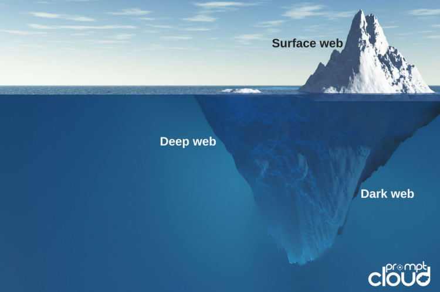
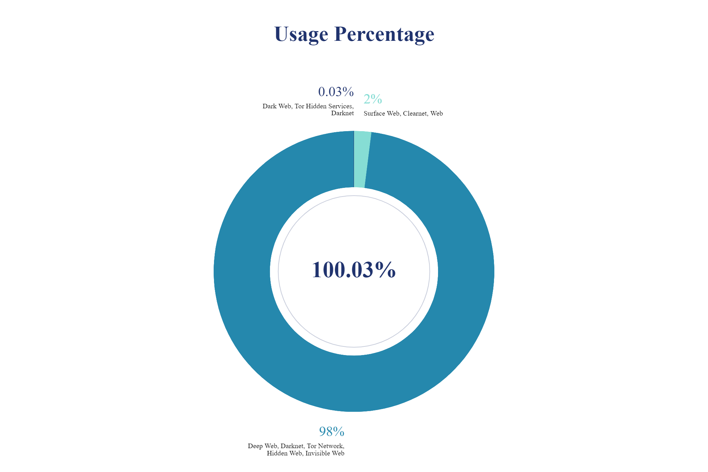

Goals:

- Navigate and use the Deep Web
- Understand common myths and why they are wrong
- Strong understanding of the tools and systems used

Up Ahead:

- Section 1: Learn the In's and Out's
- Section 2: Getting Hands On

## Learning the In's and Out's
### Deep, Dark and Surface Web

**Surface Web**: surface on the internet, everything you use everyday
**Deep Web**: part of internet, private emails, facebook messages, Dropbox
**Dark Web**: bottomost part of the ice-berg. Markets, Hidden Sites, Tor Sites, Purposefully hidden, special access material

**Surface Web, Deep Web**: Microsoft Windows, Firefox, Google Chrome
**Dark Web**: Computer, Tor Web Browser, Bitcoin, Tails

## Usage Percentage

Surface Web, Clearnet, Web                                      2%
Deep Web, Darknet, Tor Network, Hidden Web, Invisible Web       98%
Dark Web, Tor Hidden Services, Darknet                          0.03%

### History of Deep Web Tools

- Timeline of the tools used

- Tor Web Browser
- Bitcoin
- Tails Operating System

#### TOR WEB BROWSER

- Onion Routing created in mid 1990s by US Naval Research Library
    - created to securely sent information across the web
- 1997: Darpa Furthered Development
- Alpha Version of Tor, 2002
- Tor code released under free license, 2004
- Tor Project Created, Dec 2006

#### BITCOIN

- Satoshi Nakamoto creates Bitcoin, Aug 2008

- The Genesis Block is Mined, Jan 2009

- Silk Road Market is created, Jan 2011
    Dark Web market that sprung the uses of Bitcoin and caused its value to go up dramatically 

- Bitcoins reached first all time high
    $1216.73 / 1BTC, Nov 2013

- US Govt Auctions 22000 seized Bitcoins, Jun 2014

#### TAILS

- Tails is first released, Jun 2009

- A German TV Show Reports NSA Tracking of Tails users, July 2014

- A German NewsPaper Reports NSA deems Tails a "Major Threat" And when used with other things. "Catastrophic", Dec 2014

Hidden Web Services in Dark Web
-------------------------------

- Violence
- Arms
- Social
- Hacking
- Illegitimate pornography
- Nexus
- Extremism
- Unknown
- Other Illicit
- Finance
- Drugs
- Other
- None: Down, Broken, Non-usable

