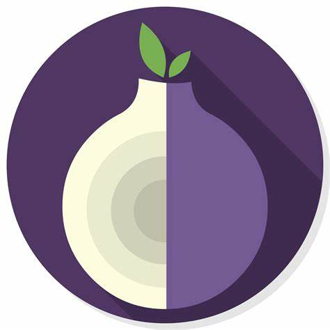

## Deep Web Myths

- Myth: It is illegal to access
- Myth: It is dangerous to access
- Myth: You will be hacked if you go on it
- Myth: It is only for criminals: Lot of it may be true, but lot of people use it, people are politically opressed and want to whistleblow what their country is doing
- Myth: You can stumble on scary sites
- Myth: Red rooms are everywhere: No proof, not true, cannot stream live video, cannot post a video to watch

## TOR (A Crucial Deep Web Tool)

- Understanding Tor
    - regular internet
- Proxy used to anonymize communication
- Used with TBB (The Tor Browser Bundle)
- Encrypts using Onion Routing
- The largest tool used in the world to anonymously connect and browse the internet

The Connection
--------------

- Go through Tor Nodes
- There is always a minimum of three connections to the Tor Network
- More than 3 can be vulnerable for interception and flaws

Tor Network
-----------

- Computer first connects to the Tor Network
- Connection to Tor Network is not secure
- Begins to enter the Tor network
    - Tor Node
    - Tor Nodee
    - Computer
- Ends to the Dark Web Service
- These messages are encrypted/sent using Onion Routing

## PGP (Pretty Good Privacy)

- Encrypt messages online
- Encrypt emails, textx, files and more
- Used on the Dark Web to share private information
- Created in 1991
- Closest to military-grade encryption known

Understanding PGP
-----------------

- Creates a public and private key
- Shares public key with Rob
- Encrypts message with Zacks Key
- Send message to Zack
