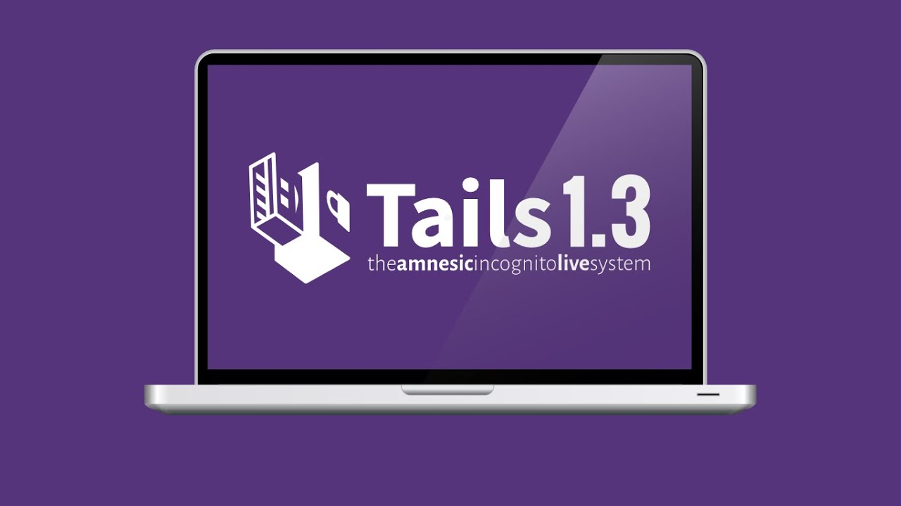

## TAILS OPERATING SYSTEM

- Operating System used to access the dark web
- Super Anonymous
- Built off of a Linux distribution
- Separates your information and keeps computer hardware into safe
- Pretty widely used 
- Highly critized
- Free to Use

