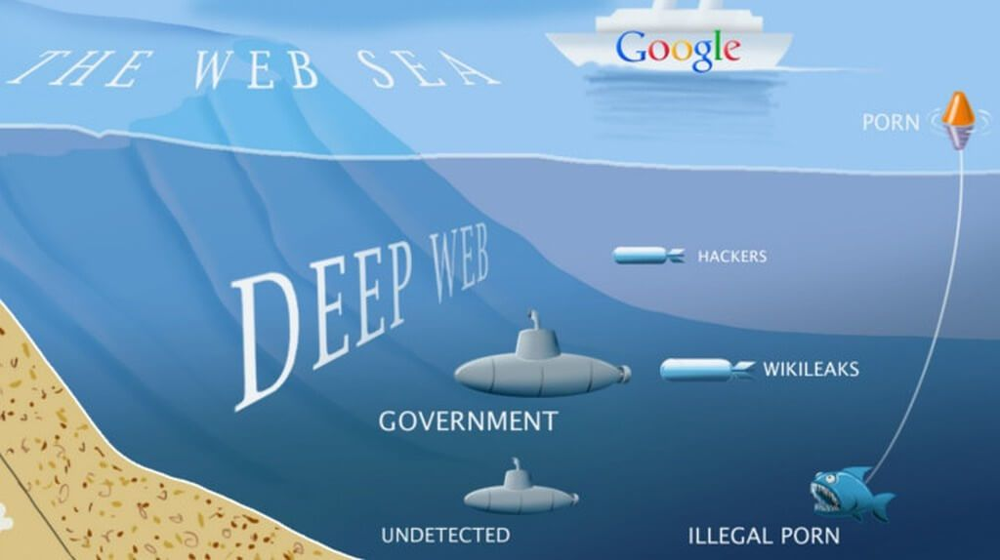

Deep Web vs Dark Web
--------------------

1. URLs are different
- www.google.com (.net, .org, etc...) - Name and top level domain.
2. Browsing is different
- Google isn't the best, not indexing them
- Deep Web Search Engines

- How to install and operate Tails
- How to purchase Bitcoin anonymously
- Purchase items and get them shipped from Dark Net Markets
- How to Use PGP on Tails
- In-Depth explanation of Tor and Bitcoin

